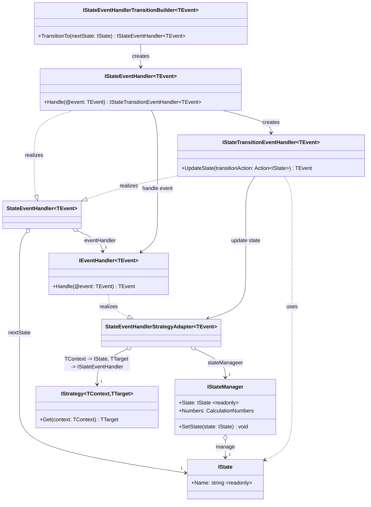

# Calculator Solution

A C# implementation of a calculator designed to demonstrate Object-Oriented Programming (OOP) principles and SOLID
design patterns. This project focuses on clean architecture and extensibility rather than just functionality.

## 🎯 Purpose

This project serves as an educational example of how to apply:

- **SOLID principles** in a real-world application
- **Design patterns** to create flexible, maintainable code
- **Clean architecture** with proper separation of concerns
- **State machine** implementation for operation management

## 🏗️ Architecture

The calculator is built using a state machine pattern with the following key components:

### Core Components

#### Calculator.States.Context.Interfaces

- **`IState`**: Main interface for machine states

#### Calculator.States.Interface

- **`IStateManager`**: Main interface to manage the current state
- **`IStateEventHandler`**: Main interface to prepare state transition after event handling
- **`IStateTransitionEventHandler`**: Main interface to complete state transition after event handling
- **`IStateEventHandlerTransitionBuilder`**: Main interface to build state event handlers with associated transitions

#### Calculator.Events.Handlers.Adapters

- **`StateEventHnadlerStrategyAdapter`**: Adapter to handle events and update the state of the program strategically



### SOLID Principles Applied

1. **Single Responsibility**: Each class has one clear purpose
2. **Open/Closed**: Easy to extend with new operations without modifying existing code
3. **Liskov Substitution**: Operations can be substituted via the IOperation interface
4. **Interface Segregation**: Focused interfaces for specific functionalities
5. **Dependency Inversion**: Depend on abstractions, not concrete implementations

## 🚀 Getting Started

### Prerequisites

- .NET 6.0 or later
- Git

### Installation

1. Clone the repository:

```bash
git clone https://github.com/Meex-Work/CalculatorSolution.git
cd CalculatorSolution
```

2. Build the solution:

```bash
dotnet build
```

3. Run the application:

```bash
dotnet run --project CalculatorConsole
```

### Modifying Behavior

The state machine pattern allows easy modification of calculator behavior by extending the `CalculatorState` class or
creating new state implementations.

## 🧪 Testing

Run the test suite to verify functionality:

```bash
dotnet test
```

## 🤝 Contributing

This is an educational project, but contributions that demonstrate additional design patterns or improve the SOLID
implementation are welcome.

## 📝 License

This project is open source and available under the [GPLv3 License](LICENSE).

## 🎓 Learning Resources

- [SOLID Principles](https://en.wikipedia.org/wiki/SOLID)
- [Design Patterns](https://refactoring.guru/design-patterns)
- [Clean Architecture](https://blog.cleancoder.com/uncle-bob/2012/08/13/the-clean-architecture.html)

## 📧 Contact

For questions about this implementation, please open an issue on GitHub.

---

**Note**: This project emphasizes code structure and design principles over complex calculator functionality. The
simplicity allows for clear demonstration of OOP concepts.